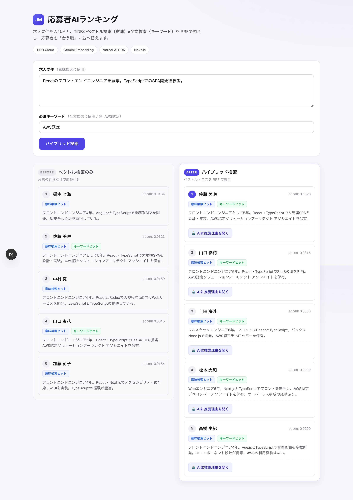
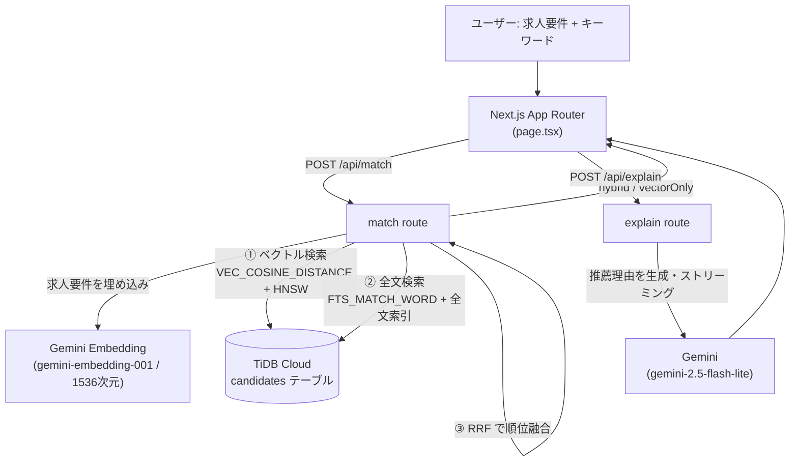

# 応募者AIランキング — TiDBハイブリッド検索 × AIマッチング

求人要件を入力すると、**TiDB のベクトル検索（意味）と全文検索（キーワード）を RRF で融合**し、
応募者を「要件に合う順」にランキングする Web アプリです。さらに上位者については、
**なぜマッチするのかを Gemini が日本語でストリーミング生成**します。

> 「ベクトル検索だけ」と「ハイブリッド検索」を**ビフォー/アフターで並べて比較**できるのが特徴です。
> 全文検索による"救済"で、意味検索だけでは埋もれていた応募者が浮上する様子がひと目で分かります。



---

## なぜ作ったか

ぼくの勤め先では、求人に応募があると（多くの会社と同じく）**履歴書を AI に読ませて「自社に合いそうか」をざっくり見る**運用をしています。便利なのですが、ふと思いました。

> 応募がまとまって来たとき、1人ずつ読ませるより、**「要件に合う順」でランキングできたらラクなのでは？**

やっていることの本質は同じ（**履歴書 × 求人要件のマッチ度を測る**）。それを「1人ずつ」から「複数まとめて並べる」に広げたら何が起きるか、という**好奇心＋実験**で作った PoC です。
あわせて、前から気になっていた**ベクトル検索／RAG まわりを手を動かして学ぶ**目的も兼ねています。

---

## 何ができるか

- **ハイブリッド検索**：求人要件をベクトル化して意味の近さで探し、必須キーワードを全文検索で探し、両者を **RRF（Reciprocal Rank Fusion）** で1つのランキングに融合。
- **ビフォー/アフター比較**：「ベクトル検索のみ」と「ハイブリッド」を左右に並べ、順位の違いを可視化。
- **ヒット根拠の表示**：各応募者が「意味検索」「キーワード検索」のどちらで拾われたかをバッジ表示。
- **AI 推薦理由**：上位者について、Gemini が経歴に基づいた推薦理由を150字以内でストリーミング生成。

---

## アーキテクチャ



検索1回の詳しい処理の流れは [`docs/hybrid-search-walkthrough.md`](docs/hybrid-search-walkthrough.md) に、
具体例（4人の応募者）を追って解説しています。

---

## ハイブリッド検索の仕組み（要点）

1つの TiDB テーブルに、履歴書本文（`resume`）と、その意味ベクトル（`embedding`）を**同居**させています。

1. **ベクトル検索**：求人要件を Gemini で埋め込み、`VEC_COSINE_DISTANCE` ＋ HNSW 索引で「意味が近い順」に取得。
2. **全文検索**：必須キーワードを `FTS_MATCH_WORD`（BM25）＋全文索引で取得。
3. **RRF 融合**：各検索結果の**順位だけ**を使い、`score(id) = Σ 1 / (K + 順位)`（K=60）で合算。
   スコアの絶対値ではなく順位で融合するため、**性質の違う2つのスコアを安全に混ぜられる**のがポイント。

> 両方の検索でヒットした応募者はスコアが加算されて上位に来る。
> 一方、意味検索では埋もれていてもキーワードで拾われた応募者が"救済"され、取りこぼしが減ります。

---

## 設計判断・技術選定の理由

- **なぜ TiDB か**：ベクトル検索・全文検索・通常のリレーショナルクエリを**1つのDB・1テーブル**で完結できる。検索専用エンジンを別途立てずに済み、構成がシンプル。無料枠（TiDB Cloud Starter）で動く。
- **なぜ RRF か**：ベクトルの距離スコアと全文の BM25 スコアは**スケールも意味も異なる**ため、値の正規化は難しく不安定になりがち。RRF は**順位のみ**を使うので、ハイパラ調整なしで頑健に融合できる。
- **なぜ埋め込みを 1536 次元へ縮約するか**：`gemini-embedding-001` の既定は 3072 次元。次元を半分にしてストレージ・索引コストを抑えつつ、テーブルの `VECTOR(1536)` 定義と一致させている。
- **なぜ推薦理由は軽量モデル（flash-lite）か**：短い説明文の生成が用途で、レイテンシとコスト（無料枠）を優先。ストリーミングで体感速度も確保。
- **なぜ seed/register は本番で無効化するか**：`/api/seed` は「全削除→再投入」を行うため、公開URLから誰でも叩ける状態は危険。Vercel 環境では 403 を返し、データ投入はローカルからのみ可能にしている（[`lib/guard.ts`](lib/guard.ts)）。

---

## 技術スタック

| 領域 | 採用技術 |
|------|----------|
| フレームワーク | Next.js 16（App Router / Turbopack）, React 19 |
| AI 連携 | Vercel AI SDK v6（`ai`）, `@ai-sdk/google` |
| 埋め込み / 生成 | Gemini Embedding（`gemini-embedding-001`）, Gemini（`gemini-2.5-flash-lite`） |
| データベース | TiDB Cloud（ベクトル検索 + 全文検索）, `mysql2` |
| 言語 | TypeScript（`strict`） |
| デプロイ | Vercel |

すべて無料枠（TiDB Cloud Starter / Gemini / Vercel Hobby）で動く範囲に収めています。

---

## セットアップ

### 1. 依存関係

```bash
npm install
```

### 2. 環境変数（`.env.local`）

```bash
# TiDB Cloud 接続情報
TIDB_HOST=...
TIDB_PORT=4000
TIDB_USER=...
TIDB_PASSWORD=...
TIDB_DATABASE=...

# Gemini（@ai-sdk/google）
GOOGLE_GENERATIVE_AI_API_KEY=...
```

> `.env*` は `.gitignore` 済み。秘密情報はコミットされません。

### 3. テーブル作成（TiDB）

```sql
CREATE TABLE candidates (
    id         BIGINT       NOT NULL AUTO_INCREMENT,
    name       VARCHAR(255) NOT NULL,
    resume     TEXT         NOT NULL,
    embedding  VECTOR(1536) DEFAULT NULL,
    created_at TIMESTAMP    DEFAULT CURRENT_TIMESTAMP,
    PRIMARY KEY (id),
    -- 意味検索: コサイン距離の HNSW 索引
    VECTOR INDEX idx_embedding ((VEC_COSINE_DISTANCE(embedding))),
    -- 全文検索: 多言語パーサ（日本語対応）
    FULLTEXT INDEX idx_resume_fts (resume) WITH PARSER MULTILINGUAL
) ENGINE=InnoDB DEFAULT CHARSET=utf8mb4 COLLATE=utf8mb4_bin;
```

### 4. ダミーデータ投入（ローカルのみ）

開発サーバーを起動し、`/api/seed` を1度叩くと28人分のダミー応募者が投入されます。

```bash
npm run dev
curl -X POST http://localhost:3000/api/seed
```

### 5. 起動

```bash
npm run dev
# http://localhost:3000
```

接続確認は `GET /api/ping`（`dbOk: 1` と `embeddingDims: 1536` が返れば OK）。

---

## プロジェクト構成

```
app/
  page.tsx              UI（比較ビュー・推薦理由）
  page.module.css       デザインシステム
  layout.tsx            メタデータ
  api/
    match/route.ts      ハイブリッド検索（ベクトル + 全文 + RRF）
    explain/route.ts    推薦理由の生成（ストリーミング）
    register/route.ts   応募者の登録（本番無効）
    seed/route.ts       ダミーデータ投入（本番無効）
    ping/route.ts       ヘルスチェック
lib/
  db.ts                 TiDB 接続プール + 型付きSELECTヘルパー
  embed.ts              Gemini 埋め込み（3072→1536次元）
  guard.ts              破壊的APIの本番ガード
  types.ts              共有型
docs/
  hybrid-search-walkthrough.md   検索1回の処理を例で解説
```

---

## 今後の拡張（ロードマップ）

- **構造化フィルタ**：年収・勤務地・職種などを `WHERE` で併用した絞り込み。
- **履歴書のチャンク分割**：長い履歴書を分割して埋め込み、検索精度を向上。
- **リランカー**：上位候補を再ランキングして精度を底上げ。

---

## ライセンス

学習・ポートフォリオ目的の PoC です。
